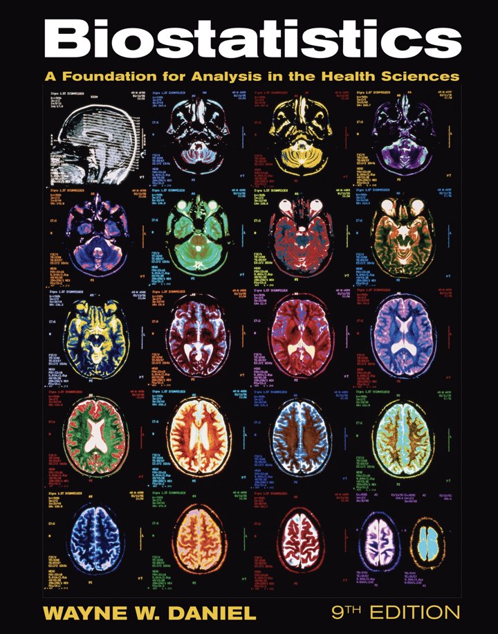

Estadística
===========

La estadística es la ciencia basada en matemáticas que recopila, organiza, analiza e interpreta datos para describir fenómenos, encontrar 
regularidades y tomar decisiones bajo incertidumbre. Su objetivo principal es convertir datos brutos en información útil, permitiendo 
realizar inferencias, predicciones y estudios de variabilidad en muestras y poblaciones.

**Libro de Referencia**

Bajar los datos del libro del siguiente URL:

https://www.dropbox.com/scl/fo/ixzp542nxu7l5sm7jnfno/ALxyknBq_EC_MSE6ARO57Vk?rlkey=mq7n77yc7kz59nekdxuiytv9j&st=g002kbl5&dl=0

**Ejercicio**

1. Empezar hacer algunos ejercicios de cada sección del capitulo 2.

